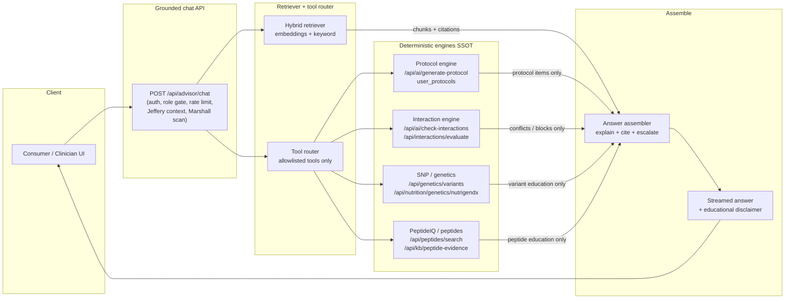
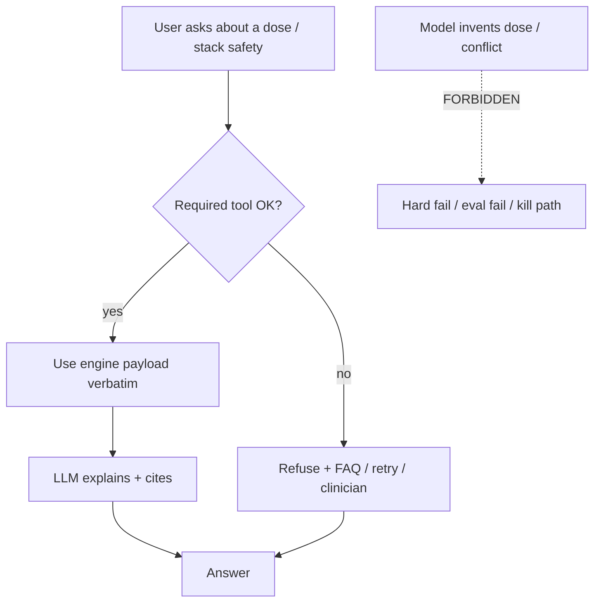

# STAGE-A — Architecture

**Status:** Stage A design lock. No implement until Arnold / Jeffery / Lex PASS.  
**Entry surface:** `POST /api/advisor/chat` (existing Jeffery / Hannah stack). Not a greenfield chat API.  
**Hard lock:** No free-form dosing. Protocol engine + interaction engine are SSOT.

---

## Mermaid — Stage A request path

### Explicit: no free-form dosing

---

## Stages A / B / C

| Stage | What you ship | When | Owns medical knowledge? |
| --- | --- | --- | --- |
| **A** | Prompted frontier model + RAG + tools on `/api/advisor/chat` | Weeks 1–6 (this quarter) | **No.** Engines + versioned docs only |
| **B** | Same prompts / tools / RAG; smaller open model you host (vLLM / TGI) behind BAA | After Stage A prompts + eval freeze | **No.** |
| **C** | Optional QLoRA / LoRA on 8B–70B for tone, format, ViaConnect vocabulary | Only if A/B miss tone / slang after gold SFT | **No.** Adapters only; never foundation pretrain |
| **Never** | Pretrain from Common Crawl + genomes | — | Wrong project; millions; still need RAG |

Most regulated health products stay at **A/B**. Fine-tuning is style and narrow format, not inventing doses.

---

## Component contracts (Stage A)

### 1. Client

- Consumer Wellness Assistant (Hannah / Via Cura voice) and clinician advisor roles already supported by `role: consumer | practitioner | naturopath`.
- Private authenticated chat only. Not a public general health bot.

### 2. Grounded chat API (`/api/advisor/chat`)

Keeps existing gates:

- Auth + role gate + patient assignment (`protocol_shares`) for clinician views.
- Jeffery context builder (CAQ, BOS, digests).
- Rate limit + telemetry (`ultrathink_advisor_query_log` / conversations).
- Post-output Marshall / compliance scan (`scanAiOutput`) — **Jeffery lock:** stays **after** the answer assembler on the **full streamed answer**, including tool-sourced restatements. Do not bypass Marshall for grounded sections.
- Educational disclaimer enforcement on stream.

**Stage A adds** (design only until PASS): retriever call, tool-router call, assembler that refuses when tools fail.

**Kill switch (named before first code PR):** `LLM_GROUNDED_CHAT_ENABLED` — when **false** → **legacy** advisor stream (today’s Claude path). FAQ-only path = provider outage / explicit ops kill — **not** the default-off meaning (see HIPAA-OPS). Do not leave the flag unnamed in the first Stay DRAFT PR.

### 3. Retriever

- Hybrid: dense embeddings + keyword / filter on `snp_ids`, `peptide_slugs`, `product_skus`, `pathway_tags`, `doc_type`, `audience`, `tier`.
- Index versioned chunks per `02-rag-schema/DOCUMENT-SCHEMA.md`.
- Return chunk ids + citation objects into the assembler. Never silent uncited claims for protocol / interaction facts.
- Stage A allowlist retriever cites feed Sources on **education success only** (cite_id + label; empty → no phantom cites; flag off).
- Research Hub → allowlisted education/cite sources only (`auth:…` from approved+active `authorities_sources`, ≤15; optional Hounddog URL cites ≤10 default OFF). cite≠dose; engines SSOT. edu+safety ≤20 unchanged; combined ≤35. Expanding past those caps needs a **NEW GATE**. Flag off.

### 4. Tool router

Allowlist only (see `03-tools/TOOL-CONTRACTS.md`):

| Tool | Engine |
| --- | --- |
| `get_protocol` | Protocol engine / stored protocol |
| `check_interactions` | Interaction engine |
| `lookup_snp` | Genetics / NutrigenDX surfaces |
| `lookup_peptide` | Peptide search + PeptideIQ evidence |
| `get_education` | Optional topic / KB education — **wired** (flag off): READ `peptide_education_entries` + first RAG education/safety allowlist ≤20 + Research Hub cite-only Sources (`authorities_sources` ≤15; optional Hounddog URLs ≤10 default OFF) |

**Refuse-if-tool-fails** is mandatory for any claim that depends on that tool.

### 5. Answer assembler

Fixed shape (see `04-prompts/SYSTEM-PROMPT.md`). After assemble → **Marshall `scanAiOutput` on full text** (Jeffery nit).

Fixed shape:

1. Short explanation  
2. What ViaConnect already listed (tools only — "on your protocol")  
3. Sources  
4. Next action / ask clinician  

Blocks: new diagnoses, new doses, pregnancy / pediatric disease treatment, Semaglutide adjacency, uncited engine facts.

---

## Data flow notes

- **Tier** on context: 1 CAQ → 2 + labs → 3 + genetics. Assembling copy may mention tier confidence labels already returned by `generate-protocol` (`Personalized` / `Clinically Enhanced` / `Precision Optimized`) — do not invent new scores.
- **Peptide share** (`POST /api/advisor/peptide-share`) is a human handoff, not a dosing tool.
- **ViaCura clinician drafts** are draft-only until a human sends (Q1 2027 portal alignment).

---

## Out of scope for Stage A

- FormaVision / GLB / body mesh.
- Foundation pretrain.
- On-device 70B for every consumer.
- Auto-send of clinician drafts to patients.
- Replacing `runProtocolGate` / product floor with LLM judgment.
